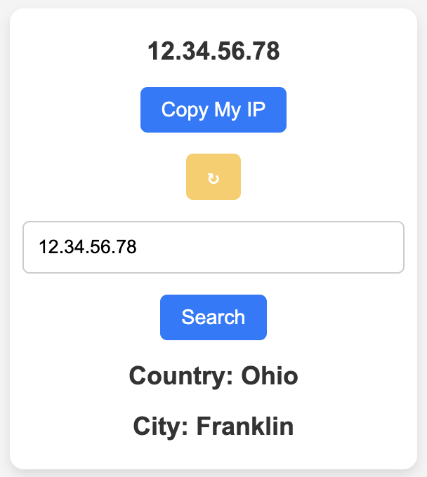

<h1>IP Find</h1>

  

----

Just one click, find your IP.

## Features

- Find your IP.
- Search IP location.

## Usage

Install from Chrome extension webstore [here](https://chrome.google.com/webstore/detail/ip-find/mjajkngihnkkbddplmehnaccpkelpeem).

## Permissions

- `clipboardWrite`: 當用戶選擇“複製我的 IP”選項時，我們需要此權限來將 IP 地址複製到剪貼簿中。

- `clipboardRead`: 用戶能夠直接從剪貼簿粘貼 IP 地址進行查詢。

## Contributors

[NatLee](https://github.com/NatLee/), Apple Paul

## License
[MIT license](./LICENSE)
