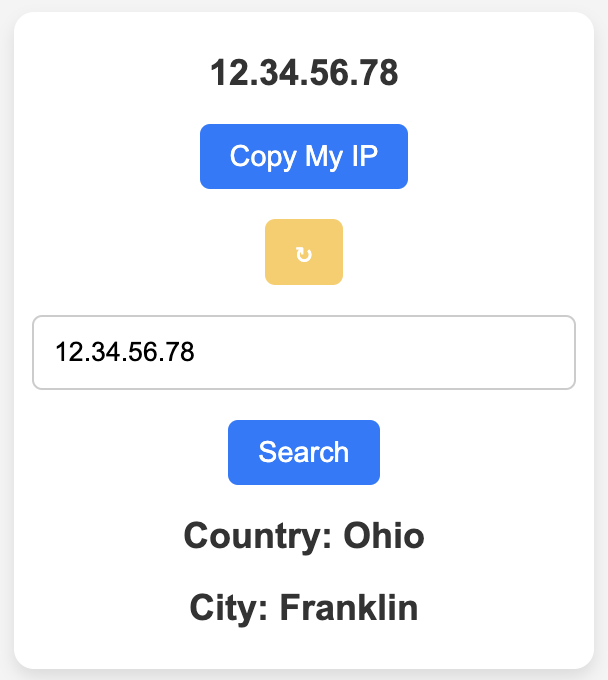

<div align="center" style="text-align: center">
<h1>IP Find</h1>


<p style="text-align: center">
  
</p>

</div>

----

Just one click, find your IP.

## Features

- See your current IP (IPv4 / IPv6) with country flag, region, city, ISP and timezone.
- Look up any IP — get country, region, city, ISP, ASN, timezone, coordinates (with Google Maps link) and postal code.
- One-click copy for your IP and for any searched IP.
- Paste from clipboard / Use-my-IP shortcut for quick lookups.
- Recent search history (last 6) — click to re-query.
- Light & dark theme, follows system preference and remembers your choice.
- Zero third-party runtime dependencies — vanilla JS, ~15 KB.

## Usage

Install from Chrome extension webstore [here](https://chrome.google.com/webstore/detail/ip-find/mjajkngihnkkbddplmehnaccpkelpeem).

## Permissions

- `clipboardWrite`: 當用戶選擇「複製我的 IP」選項時，需要此權限將 IP 地址寫入剪貼簿。
- `clipboardRead`: 讓用戶能直接從剪貼簿貼上 IP 進行查詢。

## Build & Release

### Local build

```bash
./package.sh
# → dist/ip-find-v<version>.zip
```

需要 `jq` 與 `zip`（Git Bash / WSL 內建 `zip`；`jq` 需另外安裝）。

### Automated release (GitHub Actions)

推送 `v` 開頭的 tag 會自動觸發 [`.github/workflows/release.yml`](.github/workflows/release.yml)：

```bash
git tag v3.0
git push origin v3.0
```

Workflow 會：

1. 從 `src/manifest.json` 讀版本號
2. 打包 ZIP（可直接上傳到 Chrome Web Store）
3. 如果 repo 設有 `CRX_PRIVATE_KEY` secret，額外簽出 `.crx`
4. 建立 GitHub Release 並附上產物

也可以到 **Actions → Release → Run workflow** 手動觸發，產出物會以 artifact 提供下載（不會建立 Release）。

#### CRX 簽章金鑰（選用）

```bash
openssl genrsa -out key.pem 2048
```

把 `key.pem` 的完整內容存為 GitHub repo secret `CRX_PRIVATE_KEY`。**這把金鑰決定 extension 的 ID，務必保管好且不要 commit 進 repo。**

## Privacy

The extension does not collect, transmit, or share any personal data. See the full [Privacy Policy](./PRIVACY.md) for details.

## Contributors

[NatLee](https://github.com/NatLee/), Apple Paul

## License
[MIT license](./LICENSE)
